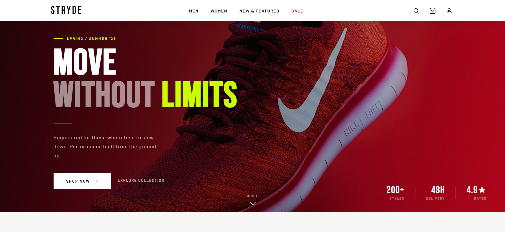
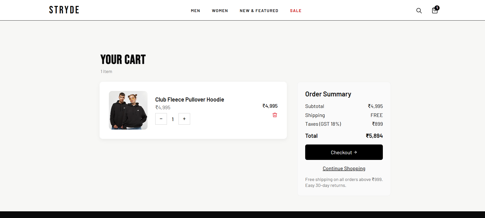
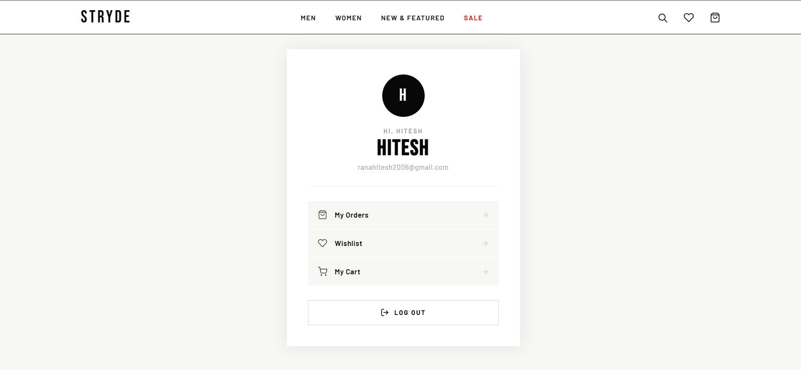

# STRYDE 

A modern Nike-inspired full-stack e-commerce website built using HTML, CSS, JavaScript, Java Servlets, and PostgreSQL.

---

## 🚀 Features

- User Authentication (Login / Signup)
- Wishlist System
- Shopping Cart
- Checkout Flow
- Profile Dashboard
- Order System
- Responsive Design
- PostgreSQL Database Integration
- Java Servlet Backend

---

## 🛠 Tech Stack

### Frontend
- HTML5
- CSS3
- JavaScript (Vanilla)

### Backend
- Java Servlets
- JDBC
- Apache Tomcat

### Database
- PostgreSQL

---

## 📸 Screenshots

### Home Page


### Login Page


### Signup Page


### Wishlist


### Cart


### Profile


---

## ⚙️ Installation

1. Clone the repository

```bash
git clone https://github.com/ranahitesh07/Stryde-eCommerce.git
```
2. Open in Eclipse
3. Configure Apache Tomcat
4. Setup PostgreSQL database
5. Run the project

## 🔥 Future Improvements

- Orders database integration
- Saved addresses system
- Payment gateway
- Admin dashboard
- Product search
- Product filters

## 👨‍💻 Author

Hitesh Rana

---